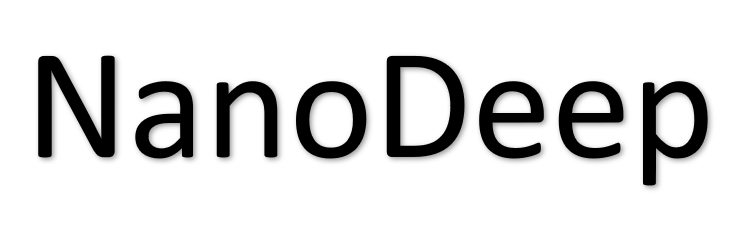

## Table of Contents

- [Background](#background)
- [Install](#install)
- [Usage](#usage)
- [Example](#example-readmes)
- [Maintainers](#maintainers)
- [Contributing](#contributing)
- [License](#license)

## Background


This is an open-source Python3 package for nanopore adaptive sample base on deep learning and the Read Until API.

The Read Until API are used to connect to MinKNOW server so that we can obtain reads data are sequenced by Nanopore sequencing.Reads data will be return to client and be classified using NanoDeep which is a deep learning model based on PyTorch.If the signal does not meet the desired criteria, it will be unblocked.

Although this package can run on both Windows and Linux if you can create the dataset yourself, we highly recommend using Linux for running this package.

The code here has been tested using MinION and NVIDIA RTX3080 on live sequencing runs and NVIDIA P620 using playback on a simulated run.You are strongly advised to test your setup prior to running (see below for example tests) as this code does affect sequencing output. Please note that running this code is at your own risk.

## Install

This project uses MinKNOW>=22.10.10. Make sure you have installed them locally.It maybe will not work on earlier versions or least versions.

```sh
pip install nanodeep
```


## Quickly start

```
nanodeep_testmodel  -data_path ./example/data/ -label_path ./example/label/ -save_path ./example/save -model_path ./example/save/model.pth -model_name nanodeep --load_to_mem -batch_size 50
```

```
nanodeep_trainmodel -data_path ./example/data/ -label_path ./example/label/ -signal_length 3000 -epochs 300 -batch_size 200 --save_best --load_to_mem -save_path ./example/save/
```


# Step by step

### Generate simulation data
Reference software：[DeepSimulator](https://github.com/liyu95/DeepSimulator)

## Make dataset
When you had generate simiulate signal of one species or genome,use draw_fast5_id to save read id as dataset label
```sh
draw_fast5_id -i path_to_your_simiulator_fast5_data -o path_to_save_id_label
```

### Train model
Please must remember the label order of your model.It is useful for Adaptive sample
```sh
nanodeep_trainmodel -data_path path_to_your_data/ -lable_path path_to_your_label/ -save_path ./save -model_name Nanodeep -device cuda:0 --save_best --load_to_mem -signal_length 4000 -epochs 100 -batch_size 50
```

### Test model
```sh
nanodeep_testmodel -data_path path_to_your_data/ -lable_path path_to_your_label/ -save_path ./save --weight_path ../path_to_your_label/your_model_name.pth -model_name Nanodeep -device cuda:0  --load_to_mem -signal_length 4000  -batch_size 50
```

### Adaptive sample
You should start sequencing in Minknow.We recommend start nanodeep_adaptivesample when device into mux scan.

The parameter --filter_which depend on the label order of you model.For example,0 Represent the first label.
```sh
nanodeep_adaptivesample --filter_type deplete --filter_which 0  --model_name nanodeep --weight_path ./save/nanodeep.pth --first_channel 1 --last_channel 256 --compute_device cuda:0 
```

### Use your own model
1.The generator in this package will return signal tensor[batch zise x channel x signal length]

2.Make sure your model is suit with this signal tensor.

3.Copy your model file into read_deep/model/ and rename what your model name

4.Write a yaml file to record Super parameter

5.Use it with parameter -model_name and -model_config

For example
```
python ./nanodeep/nanodeep_trainmodel.py -data_path ./example/data/ -label_path ./example/label/ -signal_length 3000 -epochs 30 -batch_size 200 --save_best --load_to_mem -save_path ./example/squigglenet -model_name squigglenet -model_config ./read_deep/model_config/squigglenet.yaml
```

## Maintainer

[@Yusen Lin](https://github.com/lysovosyl)


### Contributors

Thank you to the following people who participated in the project：
Jiajian Zhou、Yongjun Zhang、Han Sun

## License

[MIT](LICENSE) © Yusen Lin
